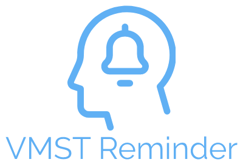

<!-- PROJECT LOGO -->
<p align="center">
  <a href="https://github.com/othneildrew/Best-README-Template">
    
  </a>

  <h3 align="center">VMST Reminder</h3>

  <p align="center">
    Monthly e-mail reminder for VMST.
    <br />
    <a href="https://github.com/othneildrew/Best-README-Template"><strong>Explore the docs »</strong></a>
    <br />
    <br />
    <a href="https://github.com/erlingde/vmst-reminder">Report Bug</a>
    ·
    <a href="https://github.com/erlingde/vmst-reminder">Request Feature</a>
  </p>
</p>

<!-- TABLE OF CONTENTS -->
<details open="open">
  <summary>Table of Contents</summary>
  <ol>
    <li>
      <a href="#about-the-project">About The Project</a>
      <ul>
        <li><a href="#built-with">Built With</a></li>
      </ul>
    </li>
    <li>
      <a href="#getting-started">Getting Started</a>
      <ul>
        <li><a href="#prerequisites">Prerequisites</a></li>
        <li><a href="#installation">Installation</a></li>
      </ul>
    </li>
    <li><a href="#license">License</a></li>
    <li><a href="#contact">Contact</a></li>
    <li><a href="#acknowledgements">Acknowledgements</a></li>
  </ol>
</details>

<!-- ABOUT THE PROJECT -->

## About The Project

[![Product Name Screen Shot][product-screenshot]](https://example.com)

This project is built as a reminding e-mail service for users on unemployment benefits. In order to receive benefits the user has to verify it's job search for the current month on [Vinnumálastofnun's](https://vinnumalastofnun.is) site between 20th and 25th of each month.

An e-mail will be sent on the 20th of every month at 13:37 GMT+0.

A list of commonly used resources that I find helpful are listed in the acknowledgements.

### Built With

- [Next.js](https://nextjs.org)
- [TypeScript](https://www.typescriptlang.org)
- [MongoDB](https://www.mongodb.com)

<!-- GETTING STARTED -->

## Getting Started

To get a local copy up and running follow these simple example steps.

### Prerequisites

- npm
  ```sh
  npm install npm@latest -g
  ```
- [Gmail account](https://mail.google.com/)
- [MongoDB Atlas cluster](https://www.mongodb.com)

### Installation

1. Generate API key at [https://www.uuidgenerator.net](https://www.uuidgenerator.net)
2. Clone the repo
   ```sh
   git clone https://github.com/erlingde/vmst-reminder.git
   ```
3. Install NPM packages
   ```sh
   npm install
   ```
4. Create file `.env.local`, see example `.env.local.example`
   ```JS
    MONGODB_URI=[ENTER URI STRING]
    MONGODB_DB=[ENTER DB NAME]
    NEXT_PUBLIC_API_KEY=[ENTER API KEY];
    GMAIL_USER=[ENTER GMAIL EMAIL ADDRESS]
    GMAIL_PASSWORD=[ENTER GMAIL PASSWORD]
   ```

<!-- LICENSE -->

## License

Distributed under the MIT License. See `LICENSE` for more information.

<!-- CONTACT -->

## Contact

Erling Erlingsson - erlingede@gmail.com

Project Link: [VMST - Reminder](https://github.com/erlingde/vmst-reminder)

<!-- ACKNOWLEDGEMENTS -->

## Acknowledgements

- [axios](https://github.com/axios/axios)
- [Font Awesome](https://fontawesome.com)
- [mjml](https://mjml.io)
- [mustache.js](https://github.com/janl/mustache.js)
- [nanoid](https://github.com/ai/nanoid)
- [Nodemailer](https://nodemailer.com/about)
- [rbx](https://dfee.github.io/rbx)

<!-- MARKDOWN LINKS & IMAGES -->
<!-- https://www.markdownguide.org/basic-syntax/#reference-style-links -->

[contributors-shield]: https://img.shields.io/github/contributors/othneildrew/Best-README-Template.svg?style=for-the-badge
[contributors-url]: https://github.com/othneildrew/Best-README-Template/graphs/contributors
[forks-shield]: https://img.shields.io/github/forks/othneildrew/Best-README-Template.svg?style=for-the-badge
[forks-url]: https://github.com/othneildrew/Best-README-Template/network/members
[stars-shield]: https://img.shields.io/github/stars/othneildrew/Best-README-Template.svg?style=for-the-badge
[stars-url]: https://github.com/othneildrew/Best-README-Template/stargazers
[issues-shield]: https://img.shields.io/github/issues/othneildrew/Best-README-Template.svg?style=for-the-badge
[issues-url]: https://github.com/othneildrew/Best-README-Template/issues
[license-shield]: https://img.shields.io/github/license/othneildrew/Best-README-Template.svg?style=for-the-badge
[license-url]: https://github.com/othneildrew/Best-README-Template/blob/master/LICENSE.txt
[linkedin-shield]: https://img.shields.io/badge/-LinkedIn-black.svg?style=for-the-badge&logo=linkedin&colorB=555
[linkedin-url]: https://linkedin.com/in/othneildrew
[product-screenshot]: images/screenshot.png
